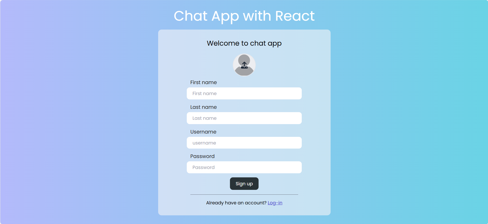
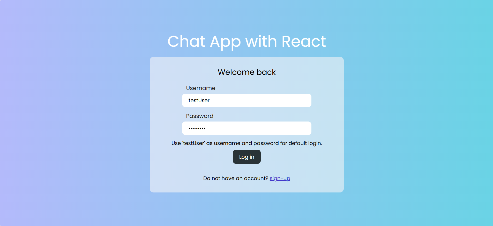
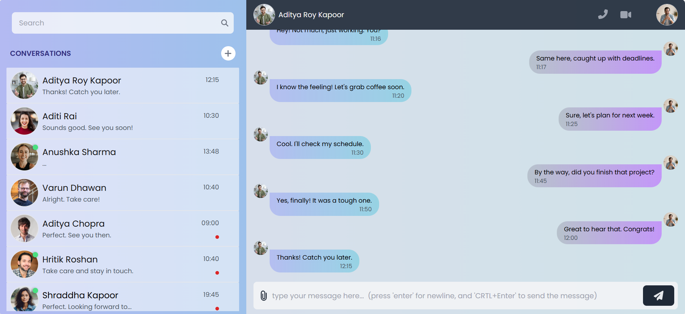
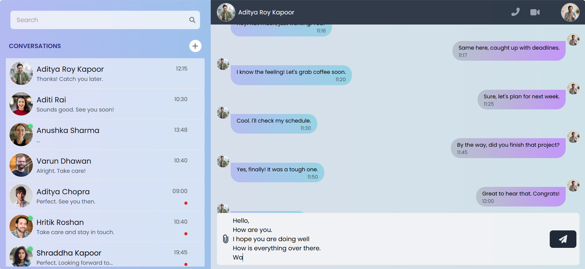
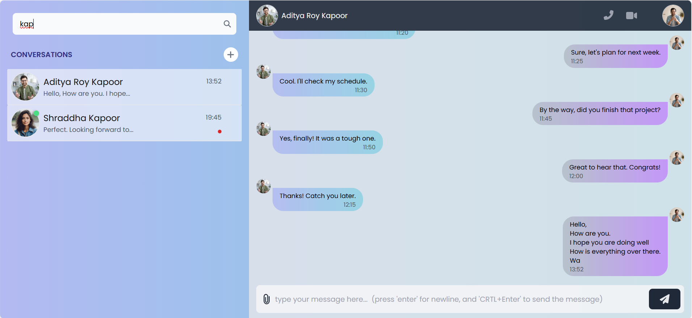
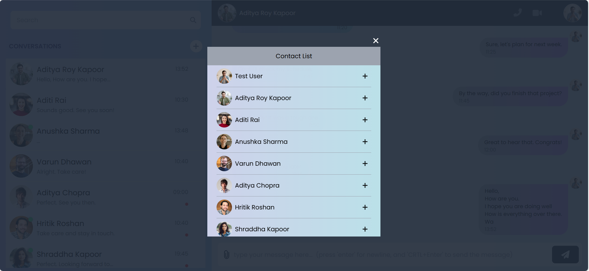
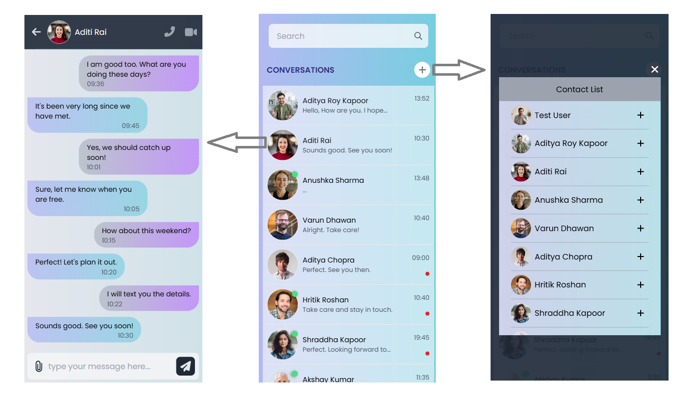

# Frontend project for chat app with React

This is a chat web application created with React library. The application is responsive and works very well on mobile screens as well as on desktops. This project contains only the frontend part of the app. To make it fully working we need to connect it to web socket and backend.   

## Features

- Visual appealing UI with colors to avoid straining of eyes
- Colors in UI good for dark as well as light theme mode. No need to have mode change option.
- Accessibility is taken care, 'rem's and 'em's units are used for sizes.
- Fully responsive application to run on all range of screen sizes
- Search option available for searching chat users.
- Multi-line message typing possible with dynamic siz eof text box
- In desktop mode, feeding a new line character with enter and sending the message using the same enter key with Ctrl key makes users very fast with typing and sending messages
- Login and signup pages are there for user login and creation.
- Modal for contact list accessible for adding a user in the chat.
- Online status of user and last message read status is shown in a visual appealing way.

## Technology used

React, TailwindCSS


## Installation

Install the project with npm
- open project folder with integrated terminal of VS Code
- run below command to install all the dependencies

```bash
  npm install
```
    
## Running Tests

To run tests in development mode, run the following command

```bash
  npm run dev
```


## Screenshots

Login page


Sign up page


Home page/ chat page


Multi-line typing with new-line characters feeding


Search box to search for users in chat


Contact list modal for adding a user into chat from your contact list


UI as appear in mobile devices



## Deployment

To deploy this project run below command to create the bundled 'dist' folder with all required files from the build graph

```bash
  npm run build
```
The example webpage is hosted here at netlify. Click below link to see the website

https://chatappavinash.netlify.app/

## Support

For support, email avinashkgupta91@gmail.com

## 🔗 Links
[](https://codesimplified.in)

[](https://www.linkedin.com/in/avinash-kumar-gupta-b4a265285/)
